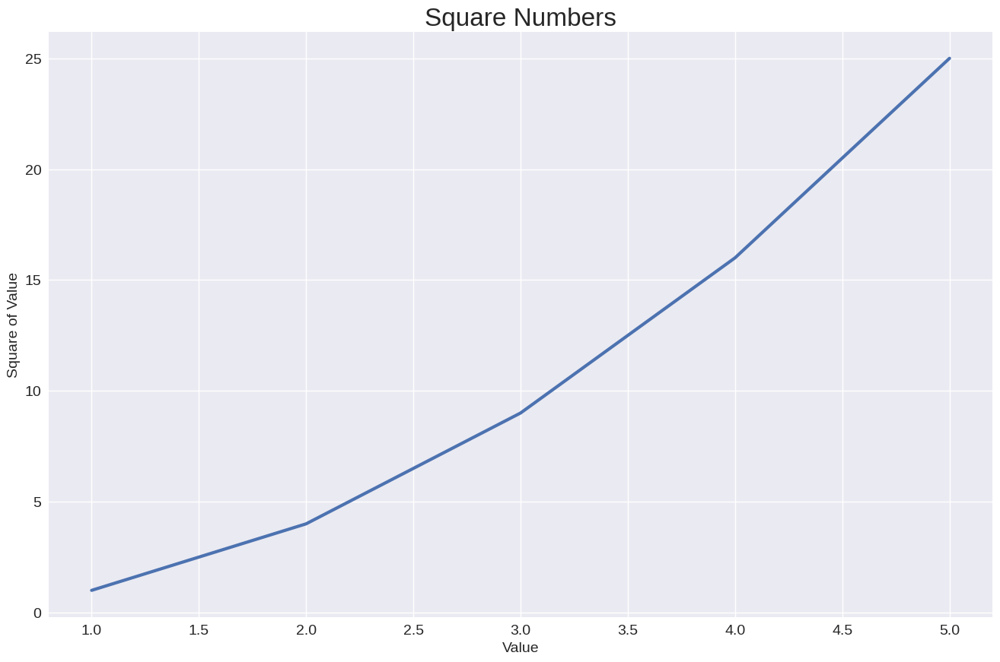
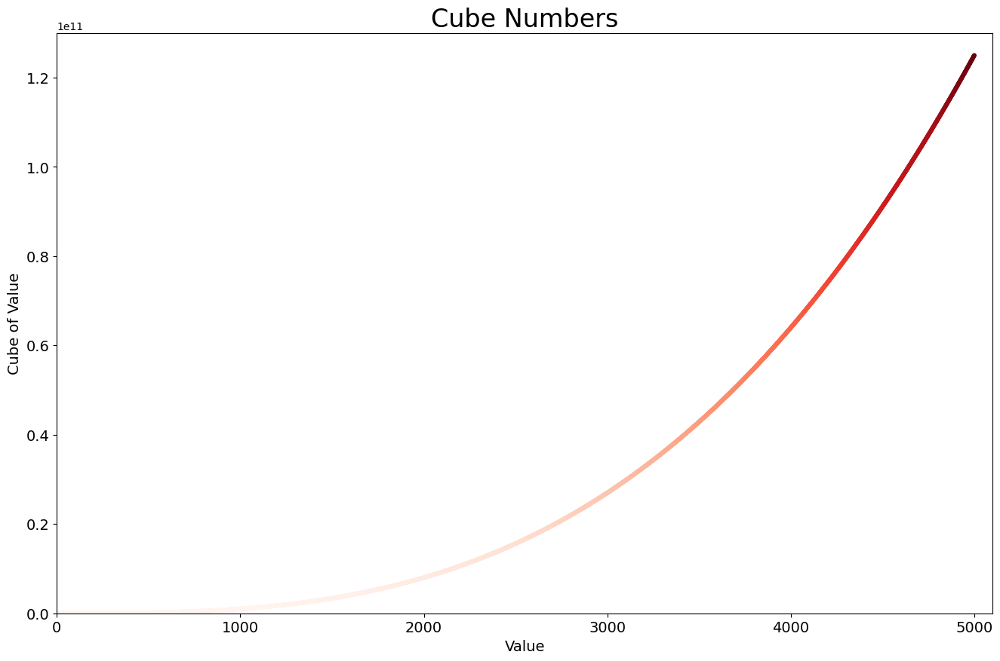
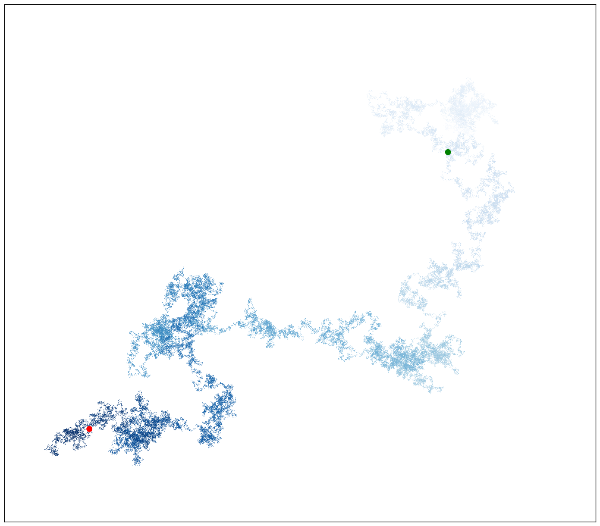
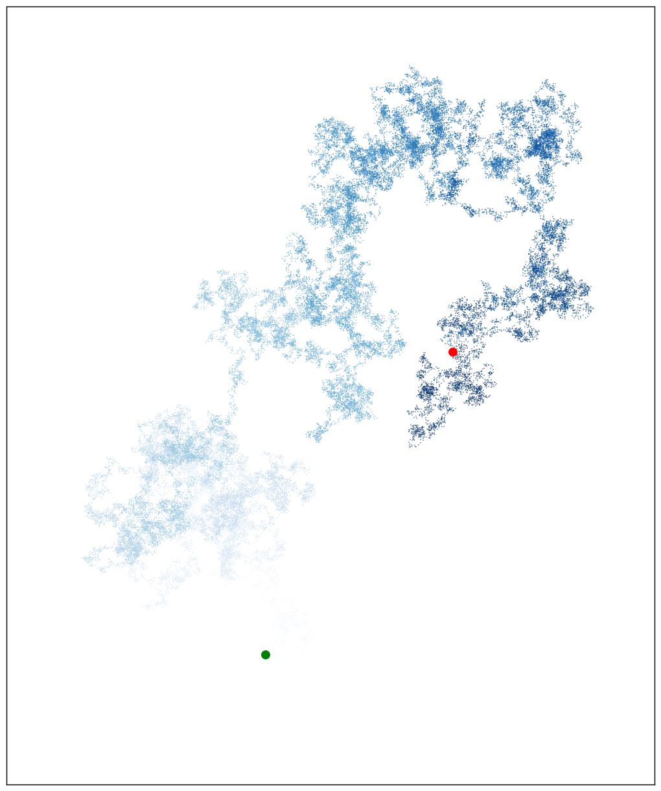
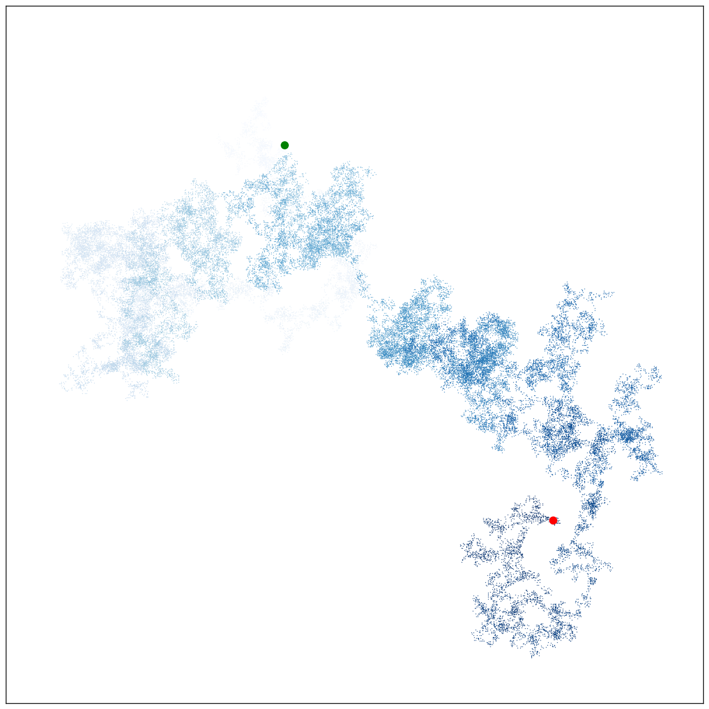
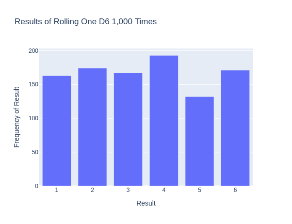
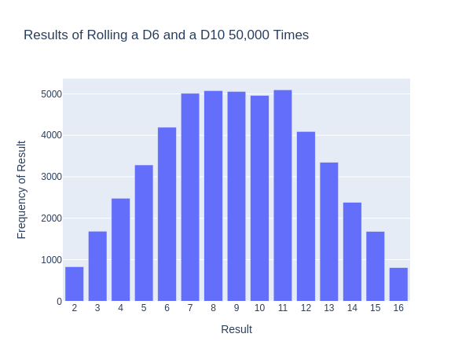
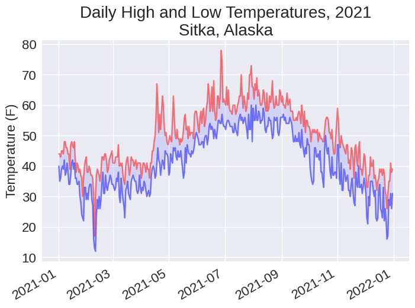
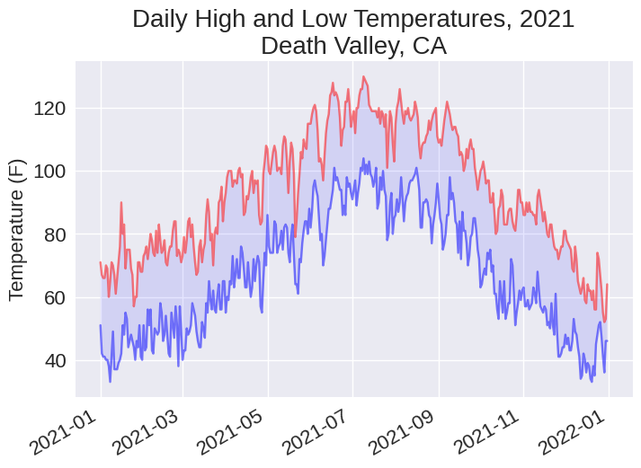
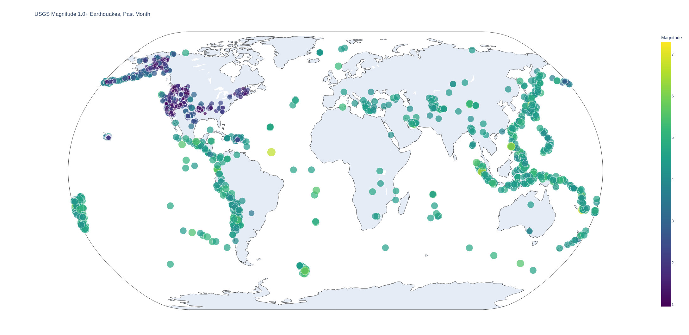

# 📊 Python Plots

A collection of data visualization projects using Python, Matplotlib, and Plotly.  
Each project demonstrates core concepts in plotting, random processes, and data interpretation using real or simulated datasets.

> 💡 Click on any image below to view it in full size.

<h3>Squares and Cubes</h3>
<p>
  These simple plots display square and cube values using Matplotlib. The values are calculated via a simple loop and plotted to show the visual growth patterns of squaring and cubing numbers.
</p>
<p align="center">
  
  
</p>

<h3>Random Walks</h3>
<p>
  These visualizations show random walk paths generated by a custom <code>Random_Walk</code> class, displayed with Matplotlib. A random walk is a mathematical process where each step is determined randomly, simulating unpredictable movement over time. This illustrates how seemingly chaotic paths can still reveal underlying structure.
</p>
<p align="center">
  
  
  
</p>

<h3>Dice Rolls</h3>
<p>
  These charts show the distribution of outcomes from simulating many rolls of dice using a custom <code>Die</code> class. The results are visualized with Plotly, highlighting the probabilities for single and multiple dice rolls.
</p>
<p align="center">
  
  
</p>

<h3>Tempearature Highs & Lows</h3>
<p>
  Temperature data from NOAA<sup>[1]</sup> is visualized here using Matplotlib. The plots compare daily high and low temperatures over time for different locations, providing insight into seasonal changes and climate differences.
</p>
<p align="center">
  
  
</p>

<h3>Earthquakes</h3>
<p>
  This visualization maps earthquake data from a full month using Plotly. The data comes from one of the United States Geological Survey's<sup>[2]</sup> earthquake data feeds in GeoJSON format. Each point represents an earthquake event, with size and color gradient indicating its magnitude, providing a global overview of seismic activity.
</p>
<p align="center">
  
</p>

## How to run a visualization

Each folder in this repository contains standalone Python scripts related to a specific visualization (e.g. squares, random walks, dice rolls, etc.).

To run any project:

1. **Clone the repository**
   ```bash
   git clone https://github.com/hqamhiyeh/python-plots.git
   cd python-plots
   ```
2. **Navigate into a project folder**
   ```bash
   cd squares  # or random_walks, dice_rolls, etc.
   ```
3. **Run the script**
   ```bash
   python script_name.py  # e.g. dice_visual_d6_d10.py
   ```

#### Dependencies

Most scripts use standard Python libraries along with:

* `matplotlib` for static plots
* `plotly` for interactive charts

To install all required packages, run `pip install -r requirements.txt`

---

<h4>Data Sources</h4>
<p>
  <sup>[1]</sup> <a href="https://www.ncei.noaa.gov/" target="_blank">National Centers for Environmental Information (NOAA)</a><br>
  <sup>[2]</sup> <a href="https://earthquake.usgs.gov/earthquakes/feed/" target="_blank">U.S. Geological Survey (USGS) Earthquake Data Feeds</a>
</p>
